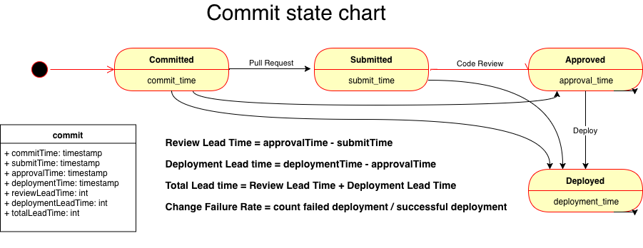
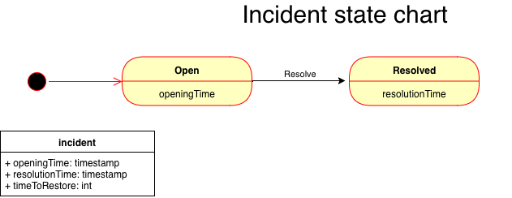

# Domain
## Event
An event is sent to signal a transition of state for a commit, or an incident.
Deployments are a type of event.
## Commit
A commit is the base unit we track in order to compute the metrics related to code review and deployments.
### Lifecycle

## Incident
An incident is created when the incident is opened and updated when resolved.
### Lifecycle

